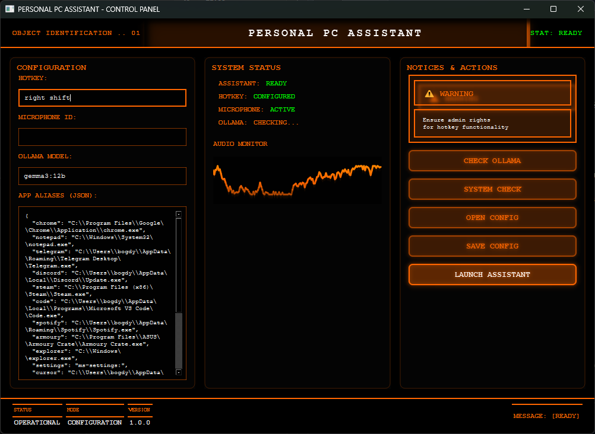

# Personal PC Assistant

A voice assistant for Windows that actually listens and executes commands. Built it because I got tired of clicking through menus and wanted my computer to feel like a conversation partner.

## How it looks

## Why this is cool

• **Animation** - Custom sci-fi/cyberpunk GUI with animated waveform that pulses from your voice in real-time, smooth fade-in on launch, glassmorphism effects  
• **Fallback** - Works even if Ollama crashes, graceful fallback guides you through setup  
• **Local AI** - Everything runs locally (Faster Whisper + Ollama), nothing goes to the cloud  
• **Ripple on buttons** - Interactive interface with ripple effects on hover, the whole UI "wakes up" when you launch it

## How to run

1. `git clone https://github.com/Bogdusik/Personal-PC-Assistant.git`
2. `cd Personal-PC-Assistant`
3. `python -m venv venv` (optional, but recommended)
4. `venv\Scripts\activate` (Windows) or `source venv/bin/activate` (Linux/Mac)
5. `pip install -r requirements.txt`
6. `ollama pull gemma3:12b` (install Ollama first from ollama.ai)
7. `python main_gui.py` (run as Administrator for hotkey support)

**Important:** Works only on Windows 10/11. Requires microphone access. Run as Administrator for hotkey functionality (default: Right Shift - hold to speak, release to process).

## What I learned from this

• Mastered speech recognition in practice - Faster Whisper is incredible  
• Got comfortable with PyQt6 and Windows API (PyCaw, win32gui, keyboard hooks)  
• Finally built something I always wanted - talking to my computer feels natural now

## Want to use it?

Fork it, improve it. I won't be offended.
